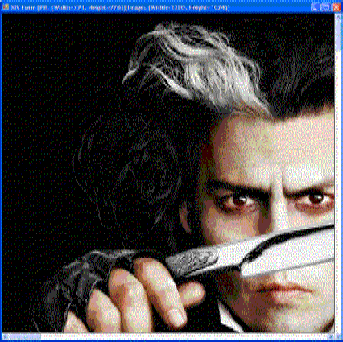

> This article was published also on [CodeProject](https://www.codeproject.com/Articles/25748/Scrollable-Image-Viewer).

The .NET Base Class Library comes with a PictureBox control that is used for displaying images. Although it offers a few scaling modes, unfortunately, it does not provide a scrolling facility. This article presents a picture box like control [Scrollable Image Viewer Control or SIV Control] that is used to display images in one of two modes:-

**Full Image Mode**: In this mode, the entire view of the image can be seen. The image is fit to the ScrollableImageViewer control window. It is like the world view we see in maps.


**Blown-up Image Mode**: In this mode, the image is not scaled, but is displayed with its original dimensions. So, if any dimension (width or height) of the image is larger than the size of the display area, then (horizontal or vertical or both) scroll bars appear, which can be used to scroll and view the image.



### Background

So, why do we need such a control? In applications where a live image display is required, a control that shows the image in one of the above two modes is desperately wanted. It is really sad that .NET BCL does not provide one. And in my experience, I have not used, and have not seen programmers using, many of the scaling modes provided by the PictureBox, except the Stretch and Normal modes. Pardon me, I may be unaware.

### Control Basics

I would say this is the easiest part of the article. Our control here is is a UserControl. It has a picture box docked to fill the area of the UserControl, and (horizontal and vertical) scrollbars docked to the edges (bottom and right). The display and value range of the scrollbars are controlled by the image chosen for display. The code snippet below shows the typical way of creating the control:-

```csharp
ScrollableImageViewer siViewer = new ScrollableImageViewer();
// var siViewer = new ScrollableImageViewer(@”C:\SomeImage.bmp”);
 
this.siViewer.Name = "siViewer";
this.siViewer.Dock = DockStyle.Fill;
this.siViewer.ShowFullImage = true; // Shows the full image
this.Controls.Add(this.siViewer);
```

### Drawing the Image

This is the IP that you have to maintain secrecy about. The DrawImage is responsible for drawing the image based on the scroll position. When the scrollbars are dragged, the image is drawn, with the offsets borrowed from the scrollbar positions so that we see the image scrolled.

```csharp
private void DrawImage(int startX, int startY)
{
  if (this.pbImage == null)
  {
  	return;
  }
 
  Graphics pbGraphics = this.pictureBox.CreateGraphics();
  var currentGraphicsContext = BufferedGraphicsManager.Current;
 
  Rectangle targetRect = new Rectangle(0, 0,
  Math.Min(this.pictureBox.DisplayRectangle.Width, this.pbImage.Width),
  Math.Min(this.pictureBox.DisplayRectangle.Height, this.pbImage.Height));
 
  using (BufferedGraphics pbGDIBuffer =
  currentGraphicsContext.Allocate(pbGraphics, targetRect))
  {
    Rectangle drawRect = new Rectangle(startX,
    startY,
    this.pbImage.Width,
    this.pbImage.Height); 
 
    pbGDIBuffer.Graphics.DrawImageUnscaledAndClipped(this.pbImage, drawRect);
 
    pbGDIBuffer.Render();
  }
}
```

### Points of Interest

Since double buffering is being used, the drawing of the image even during scrolling is flicker-free, and is also good to use for large images. Besides that, the control is tolerant to size changes. The scroll bars and the image get automatically adjusted when the control size changes. You can make the display void by setting the Picture property on the control to null. For an image which shows up the scroll bars, a large change of the value of the scroll bar is assumed as 10% of the scrollbar maximum value. That means, it is kind of hard-coded. I hope this must not be an issue. But, for cases that require this value to be changeable at runtime, a little tweak would do – take the percentage of the maximum value that the large change value has to assume.