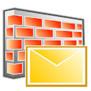

The app does not collect and/or transmit any personal information – name, address, contact information etc. No information is shared with third party apps and services.

The app reads user’s contact list only to determine if an incoming SMS is in the list. When it is not in the user’s contact list, the SMS is quarantined.
